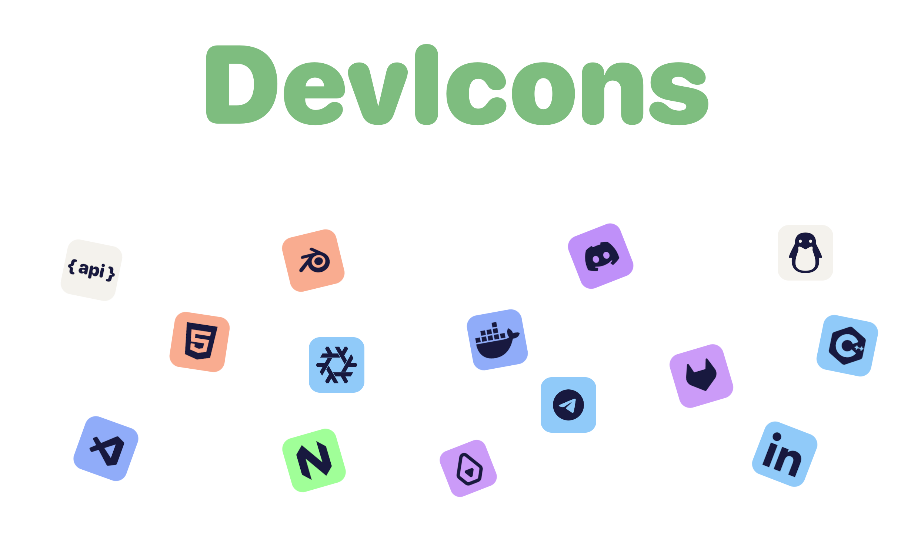

	
	 
	 
	 
	
	
	
	
	  
	
	   
	
	  

`Ctrl+F to find the badge`

| icon                                                                                                                  | Badge name     | link                                                                                                                     |
| :-------------------------------------------------------------------------------------------------------------------- | -------------- | ------------------------------------------------------------------------------------------------------------------------ |
|       | Portfolio      | [<kbd>   Open   </kbd>](https://github.com/Nighty3098/DevIcons/blob/main/badges/badges_Portfolio.png?raw=true)  |
|   | Discord server | [<kbd>   Open   </kbd>](https://github.com/Nighty3098/DevIcons/blob/main/badges/badges_discord_server.png?raw=true)  |
|       | Blog      | [<kbd>   Open   </kbd>](https://github.com/Nighty3098/DevIcons/blob/main/badges/badges_blog.png?raw=true)      |
|  | LinkedIn        | [<kbd>   Open   </kbd>](https://github.com/Nighty3098/DevIcons/blob/main/badges/badges_LinkedIn_badge.png?raw=true) |
|           | Site   | [<kbd>   Open   </kbd>](https://github.com/Nighty3098/DevIcons/blob/main/badges/badges_Site.png?raw=true)                   |
|           | Tech Support   | [<kbd>   Open   </kbd>](https://github.com/Nighty3098/DevIcons/blob/main/badges/badges_TechSupport.png?raw=true)                   |

Social

| icon                                                                                                            | Badge name | link                                                                                                                  |
| :-------------------------------------------------------------------------------------------------------------- | ---------- | --------------------------------------------------------------------------------------------------------------------- |
|    | Reddit     | [<kbd>   Open   </kbd>](https://github.com/Nighty3098/DevIcons/blob/main/badges/badges_reddit.png?raw=true)   |
|  | Telegram   | [<kbd>   Open   </kbd>](https://github.com/Nighty3098/DevIcons/blob/main/badges/badges_telegram.png?raw=true) |
|   | Discord    | [<kbd>   Open   </kbd>](https://github.com/Nighty3098/DevIcons/blob/main/badges/badges_discord.png?raw=true)  |
|    | Signal     | [<kbd>   Open   </kbd>](https://github.com/Nighty3098/DevIcons/blob/main/badges/badges_signal.png?raw=true)   |
|         | x          | [<kbd>   Open   </kbd>](https://github.com/Nighty3098/DevIcons/blob/main/badges/badges_x.png?raw=true)        |
|   | YouTube    | [<kbd>   Open   </kbd>](https://github.com/Nighty3098/DevIcons/blob/main/badges/badges_youtube.png?raw=true)  |
|  | LinkedIn   | [<kbd>   Open   </kbd>](https://github.com/Nighty3098/DevIcons/blob/main/badges/badges_linkedIn.png?raw=true) |
|    | Matrix     | [<kbd>   Open   </kbd>](https://github.com/Nighty3098/DevIcons/blob/main/badges/badges_matrix.png?raw=true)   |

Languages

| icon                                                                                                              | Badge name | link                                                                                                                  |
| :---------------------------------------------------------------------------------------------------------------- | ---------- | --------------------------------------------------------------------------------------------------------------------- |
|        | BASH       | [<kbd>   Open   </kbd>](https://github.com/Nighty3098/DevIcons/blob/main/badges/badges_bash.png?raw=true)       |
|         | C++        | [<kbd>   Open   </kbd>](https://github.com/Nighty3098/DevIcons/blob/main/badges/badges_cpp.png?raw=true)        |
|           | C          | [<kbd>   Open   </kbd>](https://github.com/Nighty3098/DevIcons/blob/main/badges/badges_c.png?raw=true)          |
|         | CSS        | [<kbd>   Open   </kbd>](https://github.com/Nighty3098/DevIcons/blob/main/badges/badges_css.png?raw=true)        |
|        | HTML       | [<kbd>   Open   </kbd>](https://github.com/Nighty3098/DevIcons/blob/main/badges/badges_html.png?raw=true)       |
|  | JS         | [<kbd>   Open   </kbd>](https://github.com/Nighty3098/DevIcons/blob/main/badges/badges_javascript.png?raw=true) |
|    | Markdown   | [<kbd>   Open   </kbd>](https://github.com/Nighty3098/DevIcons/blob/main/badges/badges_markdown.png?raw=true)   |
|      | Python     | [<kbd>   Open   </kbd>](https://github.com/Nighty3098/DevIcons/blob/main/badges/badges_python.png?raw=true)     |
|  | TypeScript | [<kbd>   Open   </kbd>](https://github.com/Nighty3098/DevIcons/blob/main/badges/badges_typescript.png?raw=true) |
|        | rust       | [<kbd>   Open   </kbd>](https://github.com/Nighty3098/DevIcons/blob/main/badges/badges_rust.png?raw=true)       |
|         | lua        | [<kbd>   Open   </kbd>](https://github.com/Nighty3098/DevIcons/blob/main/badges/badges_lua.png?raw=true)        |
|        | ruby       | [<kbd>   Open   </kbd>](https://github.com/Nighty3098/DevIcons/blob/main/badges/badges_ruby.png?raw=true)       |
|         | php        | [<kbd>   Open   </kbd>](https://github.com/Nighty3098/DevIcons/blob/main/badges/badges_php.png?raw=true)        |
|       | gleam      | [<kbd>   Open   </kbd>](https://github.com/Nighty3098/DevIcons/blob/main/badges/badges_gleam.png?raw=true)      |
|       | java      | [<kbd>   Open   </kbd>](https://github.com/Nighty3098/DevIcons/blob/main/badges/badges_java.png?raw=true)      |
|       | golang      | [<kbd>   Open   </kbd>](https://github.com/Nighty3098/DevIcons/blob/main/badges/badges_golang.png?raw=true)      |

BD

| icon                                                                                                                  | Badge name     | link                                                                                                                      |
| :-------------------------------------------------------------------------------------------------------------------- | -------------- | ------------------------------------------------------------------------------------------------------------------------- |
|             | SQL            | [<kbd>   Open   </kbd>](https://github.com/Nighty3098/DevIcons/blob/main/badges/badges_sql.png?raw=true)          |
|          | SQLite         | [<kbd>   Open   </kbd>](https://github.com/Nighty3098/DevIcons/blob/main/badges/badges_sqlite.png?raw=true)       |
|             | MySql          | [<kbd>   Open   </kbd>](https://github.com/Nighty3098/DevIcons/blob/main/badges/badges_sql.png?raw=true)          |
|        | firebase       | [<kbd>   Open   </kbd>](https://github.com/Nighty3098/DevIcons/blob/main/badges/badges_firebase.png?raw=true)     |
|      | pocketbase     | [<kbd>   Open   </kbd>](https://github.com/Nighty3098/DevIcons/blob/main/badges/badges_pocketbase.png?raw=true)   |
|        | supabase       | [<kbd>   Open   </kbd>](https://github.com/Nighty3098/DevIcons/blob/main/badges/badges_supabase.png?raw=true)     |

Dev

| icon                                                                                                                  | Badge name     | link                                                                                                                      |
| :-------------------------------------------------------------------------------------------------------------------- | -------------- | ------------------------------------------------------------------------------------------------------------------------- |
|          | Docker         | [<kbd>   Open   </kbd>](https://github.com/Nighty3098/DevIcons/blob/main/badges/badges_dev.png?raw=true)            |
|             | Dev To         | [<kbd>   Open   </kbd>](https://github.com/Nighty3098/DevIcons/blob/main/badges/badges_dev.png?raw=true)            |
|            | sfml           | [<kbd>   Open   </kbd>](https://github.com/Nighty3098/DevIcons/blob/main/badges/badges_sfml.png?raw=true)           |
|              | QT             | [<kbd>   Open   </kbd>](https://github.com/Nighty3098/DevIcons/blob/main/badges/badges_qt.png?raw=true)             |
|           | react          | [<kbd>   Open   </kbd>](https://github.com/Nighty3098/DevIcons/blob/main/badges/badges_react.png?raw=true)          |
|             | Api            | [<kbd>   Open   </kbd>](https://github.com/Nighty3098/DevIcons/blob/main/badges/badges_api.png?raw=true)            |
|             | Git            | [<kbd>   Open   </kbd>](https://github.com/Nighty3098/DevIcons/blob/main/badges/badges_git.png?raw=true)            |
|          | SvelteKit      | [<kbd>   Open   </kbd>](https://github.com/Nighty3098/DevIcons/blob/main/badges/badges_svelte.png?raw=true)         |
|          | gitlab         | [<kbd>   Open   </kbd>](https://github.com/Nighty3098/DevIcons/blob/main/badges/badges_gitlab.png?raw=true)         |
|  | stack_overflow | [<kbd>   Open   </kbd>](https://github.com/Nighty3098/DevIcons/blob/main/badges/badges_stack_overflow.png?raw=true) |
|          | prisma         | [<kbd>   Open   </kbd>](https://github.com/Nighty3098/DevIcons/blob/main/badges/badges_prisma.png?raw=true)         |
|      | HackTheBox     | [<kbd>   Open   </kbd>](https://github.com/Nighty3098/DevIcons/blob/main/badges/badges_HackTheBox.png?raw=true)     |
|         | Jupyter        | [<kbd>   Open   </kbd>](https://github.com/Nighty3098/DevIcons/blob/main/badges/badges_Jupyter.png?raw=true)        |
|      | OpenSource     | [<kbd>   Open   </kbd>](https://github.com/Nighty3098/DevIcons/blob/main/badges/badges_OpenSource.png?raw=true)     |
|         | postman        | [<kbd>   Open   </kbd>](https://github.com/Nighty3098/DevIcons/blob/main/badges/badges_postman.png?raw=true)        |
|         | laravel        | [<kbd>   Open   </kbd>](https://github.com/Nighty3098/DevIcons/blob/main/badges/badges_laravel.png?raw=true)        |
|             | ton            | [<kbd>   Open   </kbd>](https://github.com/Nighty3098/DevIcons/blob/main/badges/badges_ton.png?raw=true)            |

Apps

| icon                                                                                                            | Badge name | link                                                                                                                |
| :-------------------------------------------------------------------------------------------------------------- | ---------- | ------------------------------------------------------------------------------------------------------------------- |
|    | replit     | [<kbd>   Open   </kbd>](https://github.com/Nighty3098/DevIcons/blob/main/badges/badges_replit.png?raw=true)   |
|   | inkdrop    | [<kbd>   Open   </kbd>](https://github.com/Nighty3098/DevIcons/blob/main/badges/badges_inkdrop.png?raw=true)  |
|   | spotify    | [<kbd>   Open   </kbd>](https://github.com/Nighty3098/DevIcons/blob/main/badges/badges_spotify.png?raw=true)  |
|    | Notion     | [<kbd>   Open   </kbd>](https://github.com/Nighty3098/DevIcons/blob/main/badges/badges_notion.png?raw=true)   |
|  | Obsidian   | [<kbd>   Open   </kbd>](https://github.com/Nighty3098/DevIcons/blob/main/badges/badges_obsidian.png?raw=true) |

Editors

| icon                                                                                                          | Badge name | link                                                                                                              |
| :------------------------------------------------------------------------------------------------------------ | ---------- | ----------------------------------------------------------------------------------------------------------------- |
|   | xcode      | [<kbd>   Open   </kbd>](https://github.com/Nighty3098/DevIcons/blob/main/badges/badges_xcode.png?raw=true)  |
|  | VSCode     | [<kbd>   Open   </kbd>](https://github.com/Nighty3098/DevIcons/blob/main/badges/badges_vscode.png?raw=true) |
|    | Nvim       | [<kbd>   Open   </kbd>](https://github.com/Nighty3098/DevIcons/blob/main/badges/badges_nvim.png?raw=true)   |

OS

| icon                                                                                                           | Badge name | link                                                                                                               |
| :------------------------------------------------------------------------------------------------------------- | ---------- | ------------------------------------------------------------------------------------------------------------------ |
|      | nixOS      | [<kbd>   Open   </kbd>](https://github.com/Nighty3098/DevIcons/blob/main/badges/badges_nix.png?raw=true)     |
|      | mac        | [<kbd>   Open   </kbd>](https://github.com/Nighty3098/DevIcons/blob/main/badges/badges_mac.png?raw=true)     |
|  | android    | [<kbd>   Open   </kbd>](https://github.com/Nighty3098/DevIcons/blob/main/badges/badges_android.png?raw=true) |
|    | Linux      | [<kbd>   Open   </kbd>](https://github.com/Nighty3098/DevIcons/blob/main/badges/badges_linux.png?raw=true)   |
|  | windows    | [<kbd>   Open   </kbd>](https://github.com/Nighty3098/DevIcons/blob/main/badges/badges_windows.png?raw=true) |

Design

| icon                                                                                                                   | Badge name           | link                                                                                                                       |
| :--------------------------------------------------------------------------------------------------------------------- | -------------------- | -------------------------------------------------------------------------------------------------------------------------- |
|      | adobe illustrator    | [<kbd>   Open   </kbd>](https://github.com/Nighty3098/DevIcons/blob/main/badges/badges_illustrator.png?raw=true)     |
|    | adobe after effects  | [<kbd>   Open   </kbd>](https://github.com/Nighty3098/DevIcons/blob/main/badges/badges_after_effects.png?raw=true)   |
|   | adobe creative cloud | [<kbd>   Open   </kbd>](https://github.com/Nighty3098/DevIcons/blob/main/badges/badges_creative_cloud.png?raw=true)  |
|  | adobe lightroom      | [<kbd>   Open   </kbd>](https://github.com/Nighty3098/DevIcons/blob/main/badges/badges_adobe_lightroom.png?raw=true) |
|  | adobe photoshop      | [<kbd>   Open   </kbd>](https://github.com/Nighty3098/DevIcons/blob/main/badges/badges_adobe_photoshop.png?raw=true) |
|          | blender              | [<kbd>   Open   </kbd>](https://github.com/Nighty3098/DevIcons/blob/main/badges/badges_blender.png?raw=true)         |
|         | inkscape             | [<kbd>   Open   </kbd>](https://github.com/Nighty3098/DevIcons/blob/main/badges/badges_inkscape.png?raw=true)        |
|            | canva                | [<kbd>   Open   </kbd>](https://github.com/Nighty3098/DevIcons/blob/main/badges/badges_canva.png?raw=true)           |
|            | figma                | [<kbd>   Open   </kbd>](https://github.com/Nighty3098/DevIcons/blob/main/badges/badges_figma.png?raw=true)           |

